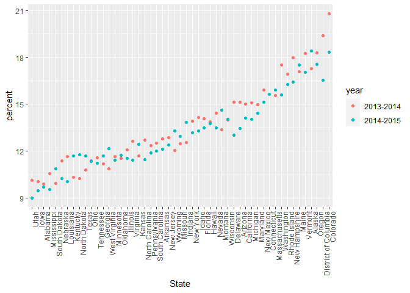
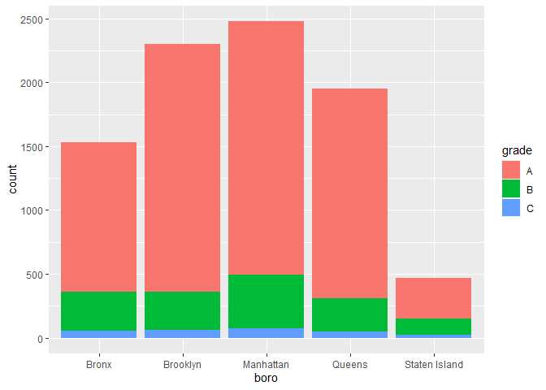
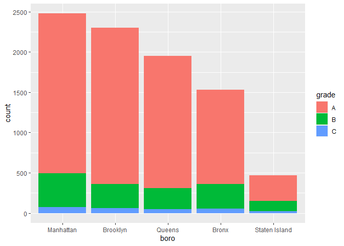
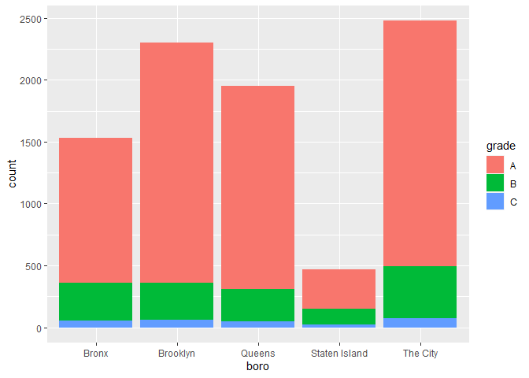
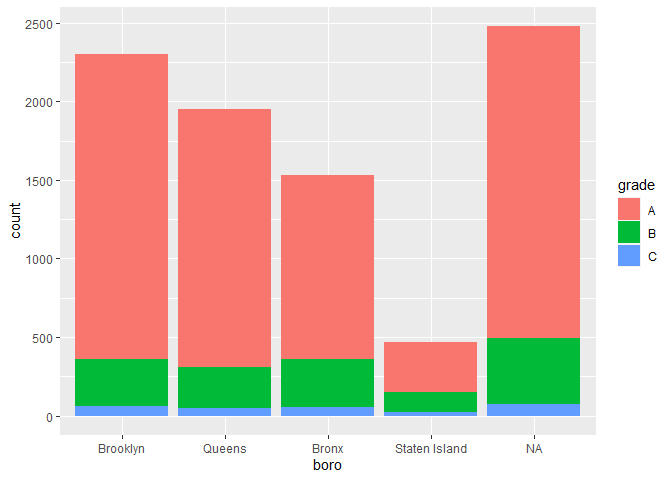
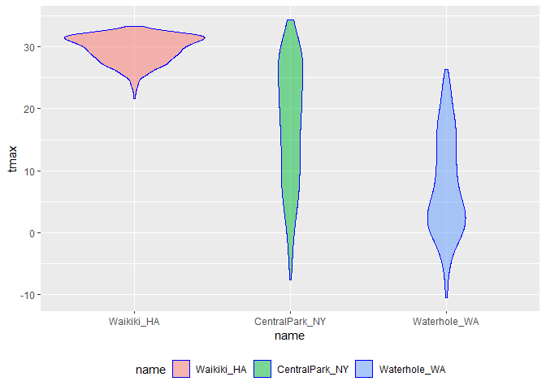
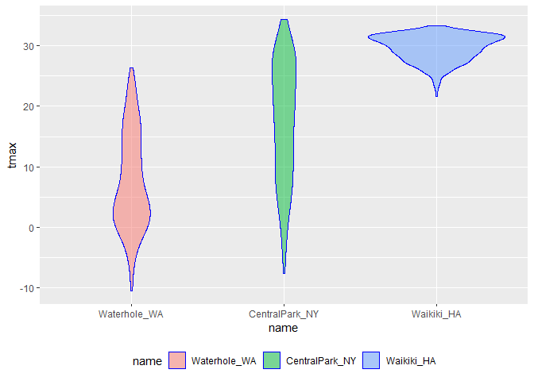
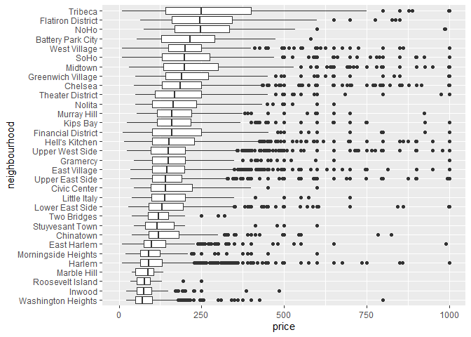

strings_and_factors
================
William Anderson
2022-10-18

``` r
library(tidyverse)
```

    ## ── Attaching packages ─────────────────────────────────────── tidyverse 1.3.2 ──
    ## ✔ ggplot2 3.3.6     ✔ purrr   0.3.4
    ## ✔ tibble  3.1.8     ✔ dplyr   1.0.9
    ## ✔ tidyr   1.2.0     ✔ stringr 1.4.1
    ## ✔ readr   2.1.2     ✔ forcats 0.5.2
    ## ── Conflicts ────────────────────────────────────────── tidyverse_conflicts() ──
    ## ✖ dplyr::filter() masks stats::filter()
    ## ✖ dplyr::lag()    masks stats::lag()

``` r
library(rvest)
```

    ## 
    ## Attaching package: 'rvest'
    ## 
    ## The following object is masked from 'package:readr':
    ## 
    ##     guess_encoding

``` r
library(p8105.datasets)
```

## Strings and regex

The most frequent operation involving strings is to search for an exact
match. You can use str_detect to find cases where the match exists
(often useful in conjunction with filter), and you can use str_replace
to replace an instance of a match with something else (often useful in
conjunction with mutate). In the following examples we’ll mostly focus
on vectors to avoid the complication of data frames, but we’ll see those
shortly.

Regex = regular expressions

``` r
string_vec = c("my", "name", "is", "Will")

str_detect(string_vec, "Will")
```

    ## [1] FALSE FALSE FALSE  TRUE

``` r
str_replace(string_vec, "Will", "will")
```

    ## [1] "my"   "name" "is"   "will"

For exact matches, you can designate matches at the beginning or end of
a line.

``` r
string_vec = c(
  "i think we all rule for participating",
  "i think i have been caught",
  "i think this will be quite fun actually",
  "it will be fun, i think")

str_detect(string_vec, "i think$")
```

    ## [1] FALSE FALSE FALSE  TRUE

“^i think” means find things that start with i think

for end of line do i think\$, finds lines that end with i think

``` r
string_vec = c(
  "Y'all remember Pres. HW Bush?",
  "I saw a green bush",
  "BBQ and Bushwalking at Molonglo Gorge",
  "BUSH -- LIVE IN CONCERT!!"
  )

str_detect(string_vec,"[Bb]ush")
```

    ## [1]  TRUE  TRUE  TRUE FALSE

str_detect(string_vec,“\[Bb\]ush”) is looking for either upper case B in
Bush or lower case b in bush but not all caps BUSH

You don’t have to list these; instead, you can provide a range of
letters or numbers that count as a match.

``` r
string_vec = c(
  '7th inning stretch',
  '1st half soon to begin. Texas won the toss.',
  'she is 5 feet 4 inches tall',
  '3AM - cant sleep :('
  )

str_detect(string_vec, "^[0-9][a-zA-Z]")
```

    ## [1]  TRUE  TRUE FALSE  TRUE

str_detect(string_vec, “[^1]\[a-zA-Z\]”) this detects a number followed
by a lower case or upper case letter at the beginning of string

The character . matches anything.

``` r
string_vec = c(
  'Its 7:11 in the evening',
  'want to go to 7-11?',
  'my flight is AA711',
  'NetBios: scanning ip 203.167.114.66'
  )

str_detect(string_vec, "7.11")
```

    ## [1]  TRUE  TRUE FALSE  TRUE

Some characters are “special”. These include \[ and \], ( and ), and ..
If you want to search for these, you have to indicate they’re special
using . Unfortunately,  is also special, so things get weird.

``` r
string_vec = c(
  'The CI is [2, 5]',
  ':-]',
  ':-[',
  'I found the answer on pages [6-7]'
  )

str_detect(string_vec, "\\[")
```

    ## [1]  TRUE FALSE  TRUE  TRUE

## Why factors are weird

Factors are the way to store categorical variables in R. They can take
on specific levels (e.g. male and female) which are usually presented as
characters but are, in fact, stored by R as integers. These integer
values are used by functions throughout R – in making plots, in
organizing tables, in determining the “reference” category – but most of
the time are hidden by easier-to-read character string labels. This
close relationship to strings, when in fact there is a lot of added
structure, is why factors can be so confusing.

This is the kind of thing that can get you in trouble.

``` r
vec_sex = factor(c("male", "male", "female", "female"))
vec_sex
```

    ## [1] male   male   female female
    ## Levels: female male

``` r
as.numeric(vec_sex)
```

    ## [1] 2 2 1 1

``` r
vec_sex = fct_relevel(vec_sex, "male")
vec_sex
```

    ## [1] male   male   female female
    ## Levels: male female

level has been reversed to have male as first

``` r
as.numeric(vec_sex)
```

    ## [1] 1 1 2 2

The previous code also illustrates coersion: forcing a variable from one
type (e.g. factor) to another (e.g. numeric). Understanding how R
coerces variables is important, because it sometimes happens
unintentionally and can break your code or impact your analyses.

For this reason, it’s important to be deliberate factors, particularly
by using functions in forcats.

## NSDUH

``` r
nsduh_url = "http://samhda.s3-us-gov-west-1.amazonaws.com/s3fs-public/field-uploads/2k15StateFiles/NSDUHsaeShortTermCHG2015.htm"

table_marj = 
  read_html(nsduh_url) %>% 
  html_table() %>% 
  first() %>%
  slice(-1)
```

There are a few steps we need to implement to tidy these data. For now
I’m not interested in the p-values (I’d rather just see the data); we
also have age groups and year ranges in column titles, both of which
are, in fact, variables. Lastly, the table includes letters as
superscripts next to table entries; if we only want the percents we’ll
need to strip these out.

``` r
data_marj = 
  
  table_marj %>%
  
  select(-contains("P Value")) %>%
  
  pivot_longer(
    -State,
    names_to = "age_year",
    values_to = "percent") %>%
  
  separate(age_year, into = c("age", "year"), sep = "\\(") %>%
  
  mutate(
    year = str_replace(year, "\\)", ""),
    percent = str_replace(percent, "[a-c]$", ""),
    percent = as.numeric(percent)) %>%
  filter(!(State %in% c("Total U.S.", "Northeast", "Midwest", "South", "West")))
```

percent = str_replace(percent, “\[a-c\]\$”, ““) - this replaces letters
a-c at the end of percent values with nothing aka removes them

year = str_replace(year, “\\)”, ““) - this replaces any parentheses in
the year column with nothing aka removes them

filter(!(State %in% c(“Total U.S.”, “Northeast”, “Midwest”, “South”,
“West”))) - this takes out any categories listed in the c() vector

We used stringr and regular expressions a couple of times above:

in separate, we split age and year at the open parentheses using “\\(”

we stripped out the close parenthesis in mutate to remove character
superscripts,

we replaced any character using “\[a-c\]\$”

Let’s quickly visualize these data for the 12-17 age group; to make the
plot readable, we’ll treat State as a factor are reorder according to
the median percent value.

``` r
data_marj %>%
  filter(age == "12-17") %>%
  mutate(State = fct_reorder(State, percent)) %>%
  ggplot(aes(x = State, y = percent, color = year)) + 
  geom_point() + 
  theme(axis.text.x = element_text(angle = 90, hjust = 1))
```

<!-- -->

mutate(State = fct_reorder(State, percent)) - this orders the state
variable in order of increasing percent of marijuana use

## Restaurant inspections

As a kind of involved example of strings and factors, we’ll take a look
at the NYC Restuarant Inspections data. Although we won’t talk about
this in detail now, it’s worth mentioning that these data were collected
using the NYC Open Data API; code is available with the data
description.

First we’ll import the data and take a look.

``` r
data("rest_inspec")

rest_inspec %>%
  group_by(boro, grade) %>%
  summarize(n = n()) %>%
  pivot_wider(names_from = grade, values_from = n)
```

    ## `summarise()` has grouped output by 'boro'. You can override using the
    ## `.groups` argument.

    ## # A tibble: 6 × 8
    ## # Groups:   boro [6]
    ##   boro              A     B     C `Not Yet Graded`     P     Z  `NA`
    ##   <chr>         <int> <int> <int>            <int> <int> <int> <int>
    ## 1 BRONX         13688  2801   701              200   163   351 16833
    ## 2 BROOKLYN      37449  6651  1684              702   416   977 51930
    ## 3 MANHATTAN     61608 10532  2689              765   508  1237 80615
    ## 4 Missing           4    NA    NA               NA    NA    NA    13
    ## 5 QUEENS        35952  6492  1593              604   331   913 45816
    ## 6 STATEN ISLAND  5215   933   207               85    47   149  6730

To simplify things, I’ll remove inspections with scores other than A, B,
or C, and also remove the restaurants with missing boro information.
I’ll also clean up boro names a bit.

``` r
rest_inspec = 
  rest_inspec %>%
  filter(grade %in% c("A", "B", "C"), boro != "Missing") %>%
  mutate(boro = str_to_title(boro))
```

str_to_title(boro)) - converts boro from all caps to just first letter
upper case

Let’s focus only on pizza places for now, and re-examine grades by
borough.

``` r
rest_inspec %>%
  filter(str_detect(dba, "Pizza")) %>%
  group_by(boro, grade) %>%
  summarize(n = n()) %>%
  pivot_wider(names_from = grade, values_from = n)
```

    ## `summarise()` has grouped output by 'boro'. You can override using the
    ## `.groups` argument.

    ## # A tibble: 5 × 3
    ## # Groups:   boro [5]
    ##   boro              A     B
    ##   <chr>         <int> <int>
    ## 1 Bronx             9     3
    ## 2 Brooklyn          6    NA
    ## 3 Manhattan        26     8
    ## 4 Queens           17    NA
    ## 5 Staten Island     5    NA

dba column has the restaurant names but we filtered by strictly “Pizza”
while there could be restaurants that are titled “PIZZA” or “pizza”

``` r
rest_inspec %>%
  filter(str_detect(dba, "[Pp][Ii][Zz][Zz][Aa]")) %>%
  group_by(boro, grade) %>%
  summarize(n = n()) %>%
  pivot_wider(names_from = grade, values_from = n)
```

    ## `summarise()` has grouped output by 'boro'. You can override using the
    ## `.groups` argument.

    ## # A tibble: 5 × 4
    ## # Groups:   boro [5]
    ##   boro              A     B     C
    ##   <chr>         <int> <int> <int>
    ## 1 Bronx          1170   305    56
    ## 2 Brooklyn       1948   296    61
    ## 3 Manhattan      1983   420    76
    ## 4 Queens         1647   259    48
    ## 5 Staten Island   323   127    21

now we visualize

``` r
rest_inspec %>%
  filter(str_detect(dba, "[Pp][Ii][Zz][Zz][Aa]")) %>%
  ggplot(aes(x = boro, fill = grade)) + 
  geom_bar() 
```

<!-- -->

Might help to have things in a different order – maybe number of pizza
places? Fortunately this can be done using fct_infreq.

``` r
rest_inspec %>%
  filter(str_detect(dba, "[Pp][Ii][Zz][Zz][Aa]")) %>%
  mutate(boro = fct_infreq(boro)) %>%
  ggplot(aes(x = boro, fill = grade)) + 
  geom_bar() 
```

<!-- -->

Suppose I want to rename a borough. I could try using str_replace.

``` r
rest_inspec %>% 
  filter(str_detect(dba, "[Pp][Ii][Zz][Zz][Aa]")) %>%
  mutate(
    boro = fct_infreq(boro),
    boro = str_replace(boro, "Manhattan", "The City")) %>%
  ggplot(aes(x = boro, fill = grade)) + 
  geom_bar() 
```

<!-- -->

This renamed the borough, but then converted the result back to a string
– which, when plotted, was implicitly made a factor and ordered
alphabetically. I could switch the order in which I rename and encode
the factor order I want, but that might not always work.

If I tried base R (maybe because I found some code online), I might try
to do this using replace.

``` r
rest_inspec %>% 
  filter(str_detect(dba, "[Pp][Ii][Zz][Zz][Aa]")) %>%
  mutate(
    boro = fct_infreq(boro),
    boro = replace(boro, which(boro == "Manhattan"), "The City")) %>%
  ggplot(aes(x = boro, fill = grade)) + 
  geom_bar()
```

    ## Warning in `[<-.factor`(`*tmp*`, list, value = "The City"): invalid factor
    ## level, NA generated

<!-- -->

That didn’t work at all! Factors have very specific values, trying to
use a value that is not an existing factor level won’t work.

Fortunately there is a dedicated function for renaming factor levels:

``` r
rest_inspec %>% 
  filter(str_detect(dba, regex("pizza", ignore_case = TRUE))) %>%
  mutate(
    boro = fct_infreq(boro),
    boro = fct_recode(boro, "The City" = "Manhattan")) %>%
  ggplot(aes(x = boro, fill = grade)) + 
  geom_bar()
```

<!-- -->

## Weather data

We saw factors in in Viz Pt 2. In that case, we were interested in
reordering a factor variable in order to produce clearer plots – ggplot
uses factor levels to determine the order in which categories appear.
Let’s revisit those examples now.

Our first step is to load the data we used.

``` r
weather_df = 
  rnoaa::meteo_pull_monitors(
    c("USW00094728", "USC00519397", "USS0023B17S"),
    var = c("PRCP", "TMIN", "TMAX"), 
    date_min = "2017-01-01",
    date_max = "2017-12-31") %>%
  mutate(
    name = recode(
      id, 
      USW00094728 = "CentralPark_NY", 
      USC00519397 = "Waikiki_HA",
      USS0023B17S = "Waterhole_WA"),
    tmin = tmin / 10,
    tmax = tmax / 10) %>%
  select(name, id, everything())
```

    ## Registered S3 method overwritten by 'hoardr':
    ##   method           from
    ##   print.cache_info httr

    ## using cached file: C:\Users\Will\AppData\Local/Cache/R/noaa_ghcnd/USW00094728.dly

    ## date created (size, mb): 2022-09-29 11:20:38 (8.418)

    ## file min/max dates: 1869-01-01 / 2022-09-30

    ## using cached file: C:\Users\Will\AppData\Local/Cache/R/noaa_ghcnd/USC00519397.dly

    ## date created (size, mb): 2022-09-29 11:20:53 (1.703)

    ## file min/max dates: 1965-01-01 / 2020-03-31

    ## using cached file: C:\Users\Will\AppData\Local/Cache/R/noaa_ghcnd/USS0023B17S.dly

    ## date created (size, mb): 2022-09-30 16:35:13 (0.952)

    ## file min/max dates: 1999-09-01 / 2022-09-30

Our first example reordered name “by hand” using fct_relevel:

``` r
weather_df %>%
  mutate(name = forcats::fct_relevel(name, c("Waikiki_HA", "CentralPark_NY", "Waterhole_WA"))) %>% 
  ggplot(aes(x = name, y = tmax)) + 
  geom_violin(aes(fill = name), color = "blue", alpha = .5) + 
  theme(legend.position = "bottom")
```

    ## Warning: Removed 3 rows containing non-finite values (stat_ydensity).

<!-- -->

We could instead reorder name according to tmax values in each name
using fct_reorder:

``` r
weather_df %>%
  mutate(name = forcats::fct_reorder(name, tmax)) %>% 
  ggplot(aes(x = name, y = tmax)) + 
  geom_violin(aes(fill = name), color = "blue", alpha = .5) + 
  theme(legend.position = "bottom")
```

    ## Warning: Removed 3 rows containing non-finite values (stat_ydensity).

<!-- -->

Although you may not have seen linear regression previously, the
ordering of factor variables play an important in this case as well.
Specifically, the ordering determines the “reference” category, and is
something that can be adjusted as needed.

``` r
weather_df %>%
  lm(tmax ~ name, data = .)
```

    ## 
    ## Call:
    ## lm(formula = tmax ~ name, data = .)
    ## 
    ## Coefficients:
    ##      (Intercept)    nameWaikiki_HA  nameWaterhole_WA  
    ##           17.366            12.291            -9.884

``` r
weather_df %>%
  mutate(name = forcats::fct_relevel(name, c("Waikiki_HA", "CentralPark_NY", "Waterhole_WA"))) %>% 
  lm(tmax ~ name, data = .)
```

    ## 
    ## Call:
    ## lm(formula = tmax ~ name, data = .)
    ## 
    ## Coefficients:
    ##        (Intercept)  nameCentralPark_NY    nameWaterhole_WA  
    ##              29.66              -12.29              -22.18

In this example, we’re also using a feature of %\>% that allows us to
specify where the tibble goes: . is a placeholder for the result of the
preceding call.

## PULSE data

``` r
pulse_data = 
  haven::read_sas("./data/public_pulse_data.sas7bdat") %>%
  janitor::clean_names() %>%
  pivot_longer(
    bdi_score_bl:bdi_score_12m,
    names_to = "visit", 
    names_prefix = "bdi_score_",
    values_to = "bdi") %>%
  select(id, visit, everything()) %>%
  mutate(
    visit = str_replace(visit, "bl", "00m"),
    visit = factor(visit)) %>%
  arrange(id, visit)

print(pulse_data, n = 12)
```

    ## # A tibble: 4,348 × 5
    ##       id visit   age sex     bdi
    ##    <dbl> <fct> <dbl> <chr> <dbl>
    ##  1 10003 00m    48.0 male      7
    ##  2 10003 01m    48.0 male      1
    ##  3 10003 06m    48.0 male      2
    ##  4 10003 12m    48.0 male      0
    ##  5 10015 00m    72.5 male      6
    ##  6 10015 01m    72.5 male     NA
    ##  7 10015 06m    72.5 male     NA
    ##  8 10015 12m    72.5 male     NA
    ##  9 10022 00m    58.5 male     14
    ## 10 10022 01m    58.5 male      3
    ## 11 10022 06m    58.5 male      8
    ## 12 10022 12m    58.5 male     NA
    ## # … with 4,336 more rows

## Airbnb

We could also use factors in an exploratory analysis of the Airbnb data,
for example when looking at the distribution of prices in various
neighborhoods. Ordering these according to the median price makes for
clearer plots than ordering neighborhoods alphabetically.

``` r
data("nyc_airbnb")

nyc_airbnb %>%
  filter(neighbourhood_group == "Manhattan") %>% 
  mutate(
    neighbourhood = fct_reorder(neighbourhood, price)) %>% 
  ggplot(aes(x = neighbourhood, y = price)) +
  geom_boxplot() +
  coord_flip() + 
  ylim(0, 1000)
```

    ## Warning: Removed 109 rows containing non-finite values (stat_boxplot).

<!-- -->

[^1]: 0-9
